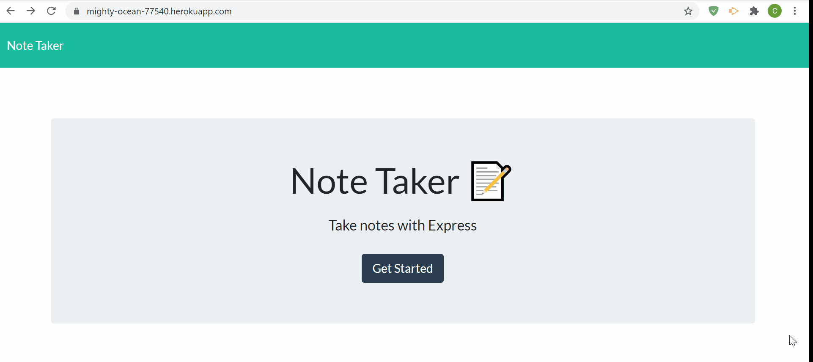

# Note Taker
  

## Description

Created an application that can be used to write, save, and delete notes. This application uses an express backend and save and retrieve note data from a JSON file.

## Table of Contents

* [installation](#installation)
* [usage](#usage)
* [license](#license)
* [contributing](#contributing)
* [test](#tests)
* [questions](#questions)

To install necessary dependencies run the following command

npm i

## Usage

## License
      
      This project is licensed under the MIT license.

## Contributing

## Tests
To run test run the following command:
'''
npm test
'''

## Home page

## Note page

## How the application works

## Deployed site
[Deployed site](https://mighty-ocean-77540.herokuapp.com/)

## Questions
If you have any questions about the repo contact me directly at c.trahan94@yahoo.com.
You can find more of my work at [ctrahan94](https://github.com/ctrahan94).

